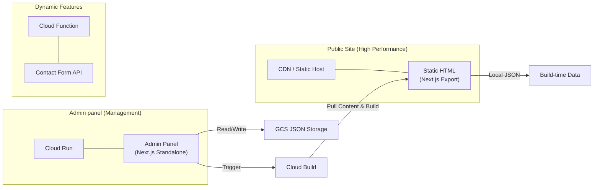

# Crisp Website — Headless Static Architecture

A high-performance, design-driven website migrated to a **headless static architecture**. This project uses Next.js Static Export for the public site, a decoupled standalone Admin panel on Cloud Run, and Serverless Cloud Functions for dynamic features.

---

## 🏗️ Architecture: Decoupled & Static

The project is split into three main components to ensure maximum performance, security, and scalability.



### Key Components:
1.  **Public Site (`/`)**: A fully static Next.js export. Content is pulled from GCS at build-time and embedded into the HTML.
2.  **Admin Panel (`admin/`)**: A standalone Next.js app deployed to Cloud Run. Manages content in GCS and triggers rebuilds.
3.  **Contact API (`functions/`)**: A serverless Cloud Function handling form submissions via Resend.

---

## 🎯 Core Philosophy: JSON-First & Build-Time Data

**CRITICAL FOR DEVELOPERS**: This project follows a strict **build-time content injection** pattern.
- **Source of Truth**: JSON files in Google Cloud Storage (GCS).
- **Public Site**: Reads content from local `src/content/data/` (synced during build via `pull-content.sh`).
- **Admin**: Directly manages GCS JSON files.

---

## 📁 Project Structure

```bash
.
├── admin/               # Standalone Admin App (Cloud Run)
├── functions/           # Serverless Cloud Functions (Contact Form)
├── src/                 # Public Site Source (Static Export)
│   ├── app/             # Public routes (Static only)
│   ├── components/      # Data-driven React components
│   ├── lib/
│   │   └── content-static.ts # Build-time filesystem reader
│   └── content/data/    # Local JSON content (synced from GCS)
├── pull-content.sh      # Syncs GCS JSON to local for build
├── deploy-all.sh   ## 🏗️ Content Architecture

### Storage Layer: Google Cloud Storage
**Bucket**: `crisp-website-485112_cloudbuild` (Production)
**Path**: JSON files stored under `data/` prefix.

### Content Flow
```
[Admin App] --(R/W)--> [GCS JSON]
                          |
                  (pull-content.sh)
                          |
                          v
[Cloud Build] --(Build)--> [Public Site (Static HTML)]
```

---

## 🤖 DEVELOPER INSTRUCTIONS: Adding New Content

### Step-by-Step Workflow

#### 1️⃣ **Define the JSON structure**
Design your data schema.
**Example**: `data/home-testimonials.json`

#### 2️⃣ **Create the JSON file in GCS** (via Admin)
Navigate to `/admin` in the Admin App to create/edit the file. This ensures it's stored in GCS.

#### 3️⃣ **Sync content locally**
To see changes during local development of the public site:
```bash
bash pull-content.sh
```
This downloads all JSON files from GCS to `src/content/data/`.

#### 4️⃣ **Define TypeScript Interface**
```typescript
// src/types/testimonials.ts
export interface Testimonial { ... }
```

#### 5️⃣ **Fetch Data in Public Page**
Use `readContentStatic` for build-time data:
```typescript
// src/app/page.tsx
import { readContentStatic } from "@/lib/content-static";
const data = await readContentStatic("home-testimonials.json");
```

#### 6️⃣ **Update Admin Sidebar**
Add the new file to the tree in `admin/src/app/admin/page.tsx`:
```typescript
const CMS_TREE = [
  { id: "home-testimonials.json", label: "Testimonials" },
];
```

#### 7️⃣ **Publish**
Trigger a rebuild via the Admin Dashboard or CLI to push changes to production.

---

## 🚀 Quick Start Checklist
- [ ] **1. Design JSON structure**
- [ ] **2. Create/Edit in Admin** (updates GCS)
- [ ] **3. Run `bash pull-content.sh`** (for local dev)
- [ ] **4. Build React component** (props-driven)
- [ ] **5. Fetch in page** (use `readContentStatic`)
- [ ] **6. Update CMS_TREE** in `admin/src/app/admin/page.tsx`
- [ ] **7. Verify & Publish**

---

## 🔧 Component Overview

- **Public Site**: Next.js (Static Export), GSAP, Tailwind.
- **Admin**: Next.js (Standalone), Radix UI, AI-powered JSON editing.
- **Contact Function**: Node.js GCF, Resend API.

---

## 📝 File Naming Conventions
- **JSON**: kebab-case (`home-hero.json`).
- **Public Routes**: `src/app/[route]/page.tsx`.
- **Admin Modules**: `admin/src/app/admin/[module]/page.tsx`.

---

## 🔐 Environment Variables
Public Site requires:
- `NEXT_PUBLIC_CONTACT_API_URL`: URL of the Cloud Function.

Admin requires:
- `GCS_BUCKET`: Name of the content bucket.
- `RESEND_API_KEY`: For email features.
- `GOOGLE_GENERATIVE_AI_API_KEY`: For AI editing.
- `ADMIN_PASSWORD`: For basic auth.
Admin-Friendly**: Every JSON file accessible in admin UI
5. **AI-Enhanced**: Natural language content editing
6. **Cache-Aware**: Automatic revalidation on content updates

---

**For AI Agents**: Always follow the 7-step checklist above. Never skip updating the AdminSidebar. Always prioritize JSON structure design before writing component code.
