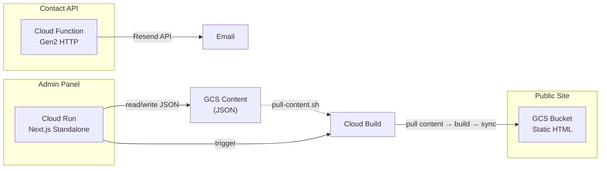

# Headless Static Architecture — Final Walkthrough

## Architecture



## What Was Built

### New Files

| File | Purpose |
|------|---------|
| [content-static.ts](file:///Users/roman/Documents/Dev/crisp-website/awwwards-case-study/src/lib/content-static.ts) | Build-time filesystem content reader |
| [pull-content.sh](file:///Users/roman/Documents/Dev/crisp-website/awwwards-case-study/pull-content.sh) | Sync 58 JSON files from GCS |
| [functions/contact/index.js](file:///Users/roman/Documents/Dev/crisp-website/awwwards-case-study/functions/contact/index.js) | Contact form Cloud Function |
| [admin/](file:///Users/roman/Documents/Dev/crisp-website/awwwards-case-study/admin/) | Standalone admin app |
| [admin deploy page](file:///Users/roman/Documents/Dev/crisp-website/awwwards-case-study/admin/src/app/admin/deploy/page.tsx) | Dashboard with publish + build history |
| [deploy-all.sh](file:///Users/roman/Documents/Dev/crisp-website/awwwards-case-study/deploy-all.sh) | Master deploy script (staging/production) |
| [setup-hosting.sh](file:///Users/roman/Documents/Dev/crisp-website/awwwards-case-study/setup-hosting.sh) | One-time GCS bucket setup |
| [DEPLOYMENT.md](file:///Users/roman/Documents/Dev/crisp-website/awwwards-case-study/DEPLOYMENT.md) | Complete deployment guide |

### Modified Files
- [next.config.ts](file:///Users/roman/Documents/Dev/crisp-website/awwwards-case-study/next.config.ts) — `output: 'export'`, unoptimized images
- 11 page files — `readContent()` → `readContentStatic()`
- [ContactForm.tsx](file:///Users/roman/Documents/Dev/crisp-website/awwwards-case-study/src/components/forms/ContactForm.tsx) — configurable API URL

## Verification Results

| Check | Result |
|-------|--------|
| Static build | ✅ 12 pages in **261ms** |
| Staging deploy | ✅ HTTP 200, 89KB HTML |
| Cloud Function | ✅ Deployed (`contact-form-staging`) |
| GCS buckets | ✅ Both staging + production created |

## Deploy Commands

```bash
# Deploy everything to staging
./deploy-all.sh staging all

# Deploy static site to production
./deploy-all.sh production site

# Deploy admin to production
./deploy-all.sh production admin
```
